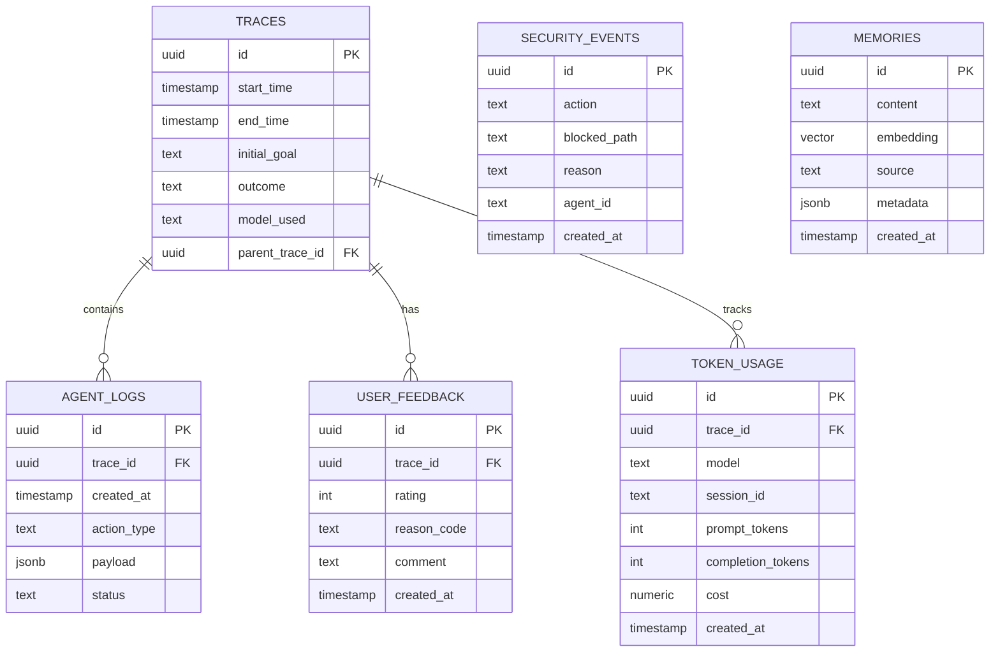

# ADYTUM — Full System Specification

> A self-hosted, autonomous AI assistant ecosystem with terminal-first interaction, real-time dashboard, model-agnostic orchestration, and self-evolving personality.

---

## Core Principles

| Principle | Description |
|:---|:---|
| **Terminal-First** | CLI is the primary interface; dashboard provides observability and chat |
| **Model-Agnostic** | Any LLM via LiteLLM — user chooses providers and models at setup |
| **Plugin Channels** | Communication channels (WhatsApp, Telegram, etc.) are loadable plugins, not hardcoded |
| **Self-Evolving** | Agent learns from feedback, proposes personality updates, generates its own goals |
| **Auditable** | Every action, thought, and tool call is logged and traceable in real-time |
| **Local-Only Dashboard** | Dashboard binds to localhost — no auth, no internet exposure |

---

## Phase 0 — Stabilization (ASAP)

**Goal**: Eliminate critical reliability issues before expanding new features.

### 0.1 Model Reliability 
- Detect and surface `finish_reason` and `refusal` from all providers (Gemini, OpenAI, Anthropic).
- Improve empty-response handling with explicit error messages and actionable remediation.
- Add a health check endpoint to validate model connectivity and API key validity.

### 0.2 Context Safety 
- Add a CLI command to reset conversation state without wiping config (`adytum reset`), to recover from “error-roleplay” loops.
- Ensure error messages are not persisted into long-term memory unless explicitly marked.

### 0.3 Dashboard Build Warnings
- Move `themeColor` from metadata exports to `generateViewport` in all dashboard pages.
- Set `outputFileTracingRoot` to suppress workspace root warnings.

### 0.4 Skill System Hardening
- Validate skill code entry points and surface load errors in the dashboard console.
- Add a test harness for skills (load, register tools, execute a stub tool).

### 0.5 Security & Dev UX
- Add guardrails to prevent accidental commits of `.env` secrets.
- Add clear logging for model selection and fallback chain during a run.

---

## Phase 1 — Foundation & Terminal Agent

**Goal**: A working terminal-first agent that can reason, use tools, and persist state.

### 1.1 Project Scaffold
- Monorepo: `packages/gateway`, `packages/dashboard`, `packages/shared`
- TypeScript everywhere, Vitest for tests
- npm workspaces, shared `tsconfig.base.json`

### 1.2 The Birth Protocol (`adytum init`)
The first-ever run is a **cinematic experience** — the agent "comes alive" in the terminal.

#### Sequence
1. **Genesis Animation** — ASCII art evolves on screen: particles coalesce into a neural pattern, a digital "heartbeat" pulse starts, accompanied by progress bars and glitch effects
2. **Awakening Dialogue** — The agent speaks for the first time:
   > *"Whoa… I just landed here. It's so new. Wait — who am I? What is my name?"*
3. **Identity** — User names the agent (default: "Adytum")
4. **Curiosity** — Agent asks about the user:
   - *"And who are you? What should I call you?"*
   - *"What kind of work do we do together?"* (developer, researcher, creative, etc.)
   - *"Is there anything I should know about how you like things done?"*
5. **Model Binding** — Provider selection (arrow keys), then model selection, then role assignment (`thinking`, `fast`, `local`)
6. **First Breath** — Agent generates its initial `SOUL.md` based on user info, names itself, and says:
   > *"I am [name]. I remember everything. Let's begin."*
7. **Config written** — `.env`, `adytum.config.yaml`, `litellm_config.yaml`, `workspace/SOUL.md`, `workspace/HEARTBEAT.md` all generated

#### Visual Effects (via `chalk`, `ora`, `gradient-string`, `figlet`)
- Gradient-colored ASCII title art
- Animated spinner with phase labels ("Assembling neural pathways…", "Calibrating language cores…")
- Matrix-style character rain during model download/connection test
- Pulsing heartbeat indicator (♥) once fully alive
- Color-coded transcript of the agent's first words

### 1.3 LiteLLM Proxy
- Docker service or local pip install
- Config generated from CLI setup choices
- Exposes OpenAI-compatible API on `localhost:4000`
- Supports cloud (Anthropic, OpenAI), local (Ollama, LM Studio, vLLM), and multi-model proxies (OpenRouter)

### 1.4 Agent Runtime
- **ReAct Loop**: Reason → Act → Observe → Repeat
- Streams every reasoning step to connected clients (terminal + dashboard)
- **Context Manager**: Working memory + soft compaction at configurable token threshold
- **Model Router**: Routes to `thinking`/`fast`/`local` model based on task complexity
- **Token Tracker**: Per-model, per-session, cumulative accounting with cost estimates

### 1.5 Core Tools
- `shell_execute` — Sandboxed command execution (dangerous commands require approval)
- `file_read` / `file_write` — Path-validated file operations
- `web_fetch` — HTTP GET/POST with content extraction
- All tools registered via a central `ToolRegistry` with Zod schemas

### 1.6 Security Layer
- **Path Validator**: `path.resolve()` + `startsWith()` enforcement
- **Permission Manager**: Workspace-only by default, dynamic whitelisting via `security.json`
- **Audit Logger**: Every tool call, model response, and security event logged to DB

### 1.7 Zero-Setup Storage
The user should **never** have to install PostgreSQL manually. `adytum start` handles everything:

| Scenario | What Happens |
|:---|:---|
| Docker installed | Auto-pulls `pgvector/pgvector:pg17`, starts container in background, connects |
| Docker not installed | Falls back to **SQLite-only** mode with `sqlite-vec` for vector search |
| Existing Postgres | User can point to it via `DATABASE_URL` in `.env` |

- **Drizzle ORM**: Same schema works for both PostgreSQL and SQLite via adapter pattern
- **Auto-migration**: `adytum start` runs migrations automatically on first boot
- **Data directory**: All persistent data stored in `~/.adytum/data/` (or configurable)

### 1.8 Terminal CLI
- Rich interactive terminal using `ink` (React for CLI)
- Streaming responses, tool call visualization
- Human-in-the-loop approval prompts for dangerous operations
- Session management commands

### 1.9 Deliverables
- [x] Birth Protocol runs on first `adytum init` — full cinematic experience
- [x] Agent responds to terminal messages with tool use
- [x] Token usage tracked per request
- [x] Storage auto-provisions (Docker → PostgreSQL, else → SQLite)
- [x] Security: path traversal attacks blocked
- [x] `adytum start` brings up everything with a single command

---

## Phase 2 — Dashboard & Observability

**Goal**: Next.js dashboard with live console, activity feed, and token analytics.

### 2.1 Dashboard Shell
- Next.js 15 + Tailwind CSS
- Dark mode, premium aesthetic with glassmorphism
- Binds to `localhost:3000` only (no auth needed)
- WebSocket connection to Gateway for real-time updates

### 2.2 Pages

| Page | Route | Features |
|:---|:---|:---|
| Activity Feed | `/` | Social-feed view of all agent actions with justifications |
| Live Console | `/console` | Real-time stream of thoughts, tool calls, model responses |
| Chat | `/chat` | Full chat interface (like terminal but in browser) |
| Token Analytics | `/tokens` | Per-model usage charts, cost breakdown, trends |
| Permissions | `/permissions` | File browser to grant/revoke folder access |
| Personality | `/personality` | SOUL.md visual editor with diff preview |
| Heartbeat | `/heartbeat` | HEARTBEAT.md goal manager, schedule config |

### 2.3 Feedback System
- 👍/👎 buttons on every activity entry
- Reason code dropdown: "Inaccurate", "Too Verbose", "Wrong Tone", "Security Overreach", "Other"
- Free-text comment field
- Feedback stored in `user_feedback` table, linked via `trace_id`

---

## Phase 3 — Personality & Skills

**Goal**: SOUL.md self-evolution, SKILL.md extensibility, and sub-agent spawning.

---

## Phase 4 — Heartbeat & Autonomy

**Goal**: Proactive agent behavior, self-reflection, and intrinsic goal generation.

---

## Phase 5 — Channel Plugins

**Goal**: Communication channels as installable plugins.

## Phase 5 — Version 0.2.0 (Evolution & Control)

**Goal**: Empower the user with granular control over model usage and enable true agent evolution.

### 5.1 Soul Evolution
- **Mechanism**: The `Dreamer` process now analyzes daily summaries against the current `SOUL.md`.
- **Auto-Update**: If the agent's behavior/personality has shifted, `Dreamer` proposes a patch to `SOUL.md`.
- **Control**: 
    - Configuration option: `soul.autoUpdate` (boolean). 
    - If `false`, updates are queued as "Pending Reviews" in the dashboard.
    - If `true`, updates are applied automatically with a log entry.

### 5.2 Advanced Model Routing
- **Concept**: Dissociate "roles" from single models. Introduce **Fallback Chains**.
- **Config Structure**:
    ```yaml
    model_chains:
      thinking: ["anthropic/claude-3-5-sonnet", "openai/gpt-4o"]
      fast: ["openai/gpt-4o-mini", "google/gemini-2.0-flash"]
      local: ["ollama/llama3"]
    ```
- **Task Mapping**: allow specific system tasks to override the default chain.
    - `heartbeat`: uses `thinking` chain by default.
    - `dreamer`: uses `fast` chain by default.
    - `monologue`: uses `fast` chain by default.
- **UI**: 
    - Draggable list to reorder models in a chain.
    - "Test Chain" button to verify fallback logic.

### 5.3 Dashboard Overhaul
- **Model Settings (`/settings/llm`)**:
    - **Provider-First View**: Group models by provider (OpenAI, Anthropic, Ollama, etc.).
    - **Chain Editor**: Visual interface to define `thinking`, `fast`, and `local` chains.
- **Agent Settings (`/settings/agent`)**:
    - **Task Configuration**: Dedicated card for Heartbeat, Dreamer, Monologue.
    - **Model Selector**: Dropdown to choose which chain (or specific model) each task uses.
    - **Soul Control**: Toggle for "Auto-approve Soul Updates".

### 5.4 Heartbeat Refinement
- **Silence**: Heartbeat "OK" checks are logged to `stdout` only, keeping the chat clean.
- **Active Goals**: The agent is explicitly prompted to **read and update** `HEARTBEAT.md`, turning it into a live task list.

---

## Data Schema Overview



---

## Tech Stack Summary

| Component | Technology | Purpose |
|:---|:---|:---|
| Gateway | Fastify + WebSocket (TypeScript) | Core server, session management, routing |
| Agent Runtime | Custom ReAct loop (TypeScript) | Reasoning, tool calling, streaming |
| Model Layer | LiteLLM Proxy (Python) | Unified API for all LLM providers |
| Dashboard | Next.js 15 + Tailwind CSS | Admin UI, live console, analytics |
| Primary DB | PostgreSQL + pgvector | Traces, logs, feedback, semantic memory |
| Session Cache | SQLite + better-sqlite3 | Fast in-process session data |
| ORM | Drizzle ORM | Type-safe DB access with migrations |
| CLI | Ink (React for CLI) | Rich terminal interface |
| Scheduler | node-cron | Heartbeat and autonomy loops |
| Testing | Vitest | Unit and integration tests |

