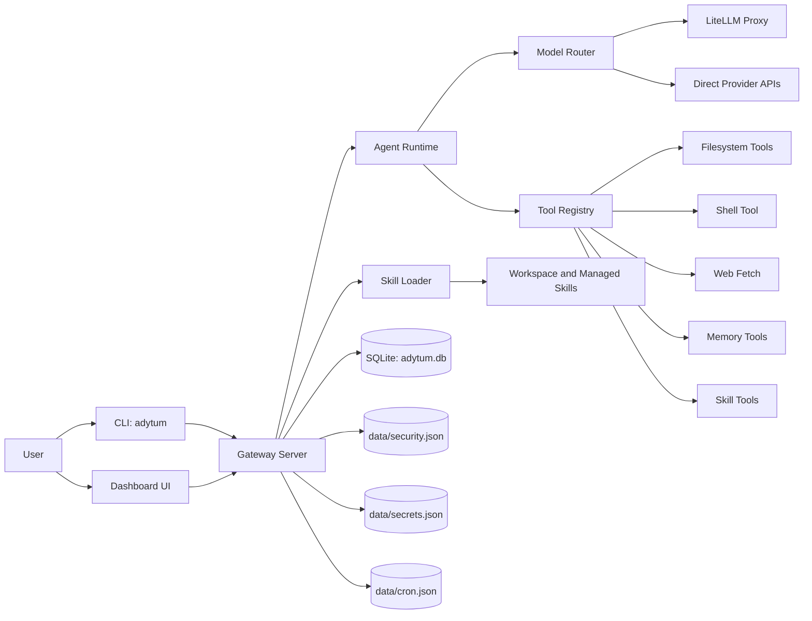

# Adytum Architecture

This document explains the runtime architecture of Adytum for contributors.

## 1. System Overview

Adytum is a monorepo with three primary packages:

- `packages/gateway`: backend runtime, API, WebSocket, tool orchestration, skill loading
- `packages/dashboard`: Next.js UI for chat, operations, skills, settings, token analytics
- `packages/shared`: shared types, schemas, protocol frames, constants, DB schema exports

At runtime, the `gateway` is the central process. It hosts:

- the model routing layer
- the ReAct agent runtime
- tool execution
- background services (heartbeat, dreamer, monologue, cron)
- REST and WebSocket APIs consumed by dashboard and CLI

## 2. High-Level Topology

## 3. Package Layout

### `packages/gateway`

- `src/index.ts`: bootstraps runtime graph and starts gateway
- `src/server.ts`: Fastify server wiring + route registration + event bridge
- `src/domain/logic`: core runtime logic (agent loop, context, token tracking, approvals)
- `src/infrastructure/llm`: model routing and provider client integration
- `src/application/services`: skill service, cron manager, dreamer, heartbeat, monologue
- `src/tools`: built-in tool definitions and registry
- `src/security`: path validation, permission checks, audit logging, secrets store
- `src/api`: REST/WebSocket controllers and route registration

### `packages/shared`

- `src/types.ts`: shared zod schemas and runtime config contracts
- `src/protocol.ts`: WebSocket frame contracts and parse/serialize helpers
- `src/constants.ts`: provider lists, dangerous commands, defaults

### `packages/dashboard`

- consumes REST and WebSocket APIs from gateway
- default startup port: `3002`

## 4. Runtime Boot Flow

`startGateway(projectRoot)` in `packages/gateway/src/index.ts` performs:

1. load and validate config from `adytum.config.yaml` + `.env`
2. setup DI container
3. auto-provision storage target (existing Postgres, Docker Postgres, or SQLite fallback)
4. initialize security services (`PermissionManager`, `SecretsStore`)
5. register built-in tools in `ToolRegistry`
6. create memory persistence (`MemoryDB`, `MemoryStore`)
7. initialize model catalog and `ModelRouter`
8. discover and initialize skills via `SkillLoader`
9. instantiate `AgentRuntime`
10. start skill services with runtime context
11. schedule background jobs (`Dreamer`, `InnerMonologue`, cron jobs)
12. start `GatewayServer` (HTTP + WS)

## 5. Request Lifecycle

User message flow:

1. client sends WS `message` frame to `/ws`
2. `AgentController` parses frame and calls `AgentRuntime.run`
3. `AgentRuntime` builds model prompt from:
   - system prompt (SOUL + tool guidance + skill context)
   - conversation history (`ContextManager`)
   - optional retrieved persistent memory
4. runtime invokes `ModelRouter.chat`
5. if model returns tool calls, runtime executes tools via `ToolRegistry`
6. tool results are appended to context, loop repeats until final assistant text
7. stream events are emitted as WS `stream` frames to connected clients
8. logs and token usage are persisted and exposed through REST APIs

## 6. Core Internal Boundaries

### Domain logic

- `AgentRuntime` controls conversation loop and tool orchestration
- `ContextManager` handles short term context and compaction
- `ApprovalService` handles pending approvals and resolve lifecycle
- `TokenTracker` emits incremental token updates

### Infrastructure

- `ModelRouter` handles chain resolution, retries, fallback, and proxy vs direct model calls
- `MemoryDB` is the current operational persistence backend for messages, memories, and metrics

### Application services

- `SkillLoader` discovers, validates, and loads plugin or instruction skills
- `CronManager` persists and runs recurring jobs
- `Dreamer` and `InnerMonologue` create autonomous memory and evolution loops

## 7. Configuration and State Surfaces

Main files:

- `adytum.config.yaml`: system and skill configuration
- `.env`: provider keys and optional overrides
- `workspace/SOUL.md`: runtime personality prompt source
- `workspace/HEARTBEAT.md`: heartbeat goals source

Data files under `data/`:

- `sqlite/adytum.db`: runtime DB (messages, memories, logs, tokens, pending updates)
- `security.json`: path permission whitelist
- `secrets.json`: per-skill secrets map
- `cron.json`: scheduled jobs
- `memories/snapshots/*.md`: Dreamer snapshots

## 8. Architecture Notes for Contributors

- Gateway is the source of truth for runtime state.
- Dashboard is primarily an observer/controller over gateway APIs.
- Skill contracts are enforced at load time (manifest + config schema).
- Security is layered: path validation, permission manager, and explicit approval flow.
- Shared zod schemas in `packages/shared` are the compatibility contract across packages.

For deeper subsystem docs, see:

- `docs/GATEWAY_RUNTIME.md`
- `docs/API_REFERENCE.md`
- `docs/SKILL_SYSTEM.md`
- `docs/SKILL_DEVELOPMENT_GUIDE.md`
- `docs/SECURITY_AND_APPROVALS.md`
- `docs/STORAGE_AND_MEMORY.md`
